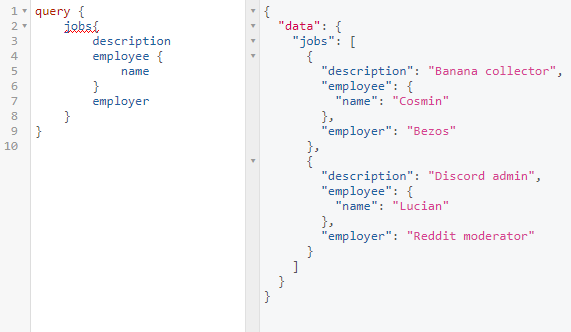
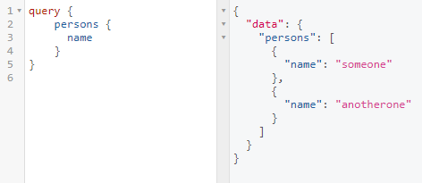
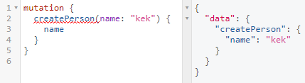

# GraphQL-Problem
Mmmm, graphql tasty.

## Files
- `credentials.json` - database credentials
- `db.js` contains the db connection and models
- `schema.js` has the graphql objects and schema
- `app.js` wraps everything together and runs the server on port `4000`

## Setup
0) Clone this repo
1) Install `MariaDB` (You can use any sequelize supported databases as long as you change the dialect in the credentials and install the required stuff) and create a db
2) Fill out `credentials.json`
3) Run `npm install`  
4) Run `npm start`
5) Open a browser and go to `localhost:4000/graphql`
6) Run the appropiate queries/mutations
7) Profit???

## GraphQL
### Querys:
- Jobs:  
  
  
- Persons:  

### Mutations:
- createJob:  
  
  
- createPerson:  
  
