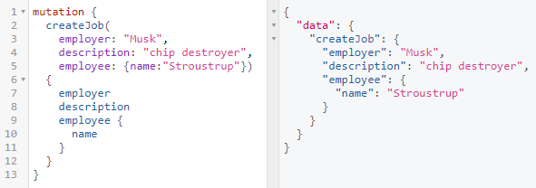

This project was a small 'test' for my Nerds.SH internship.

# GraphQL-Problem
Mmmm, graphql tasty.

## JS Files
- `db.js` contains the db connection and models
- `schema.js` has the graphql objects and schema
- `app.js` wraps everything together and runs the server on port `4000`

## Setup
0) Clone this repo and cd into it

### - Using docker
1) Run `docker-compose up -d` and its done.

### - Classical approach
1) Install `MariaDB` (You can use any sequelize supported databases as long as you change the dialect in the credentials and install the required stuff) and create a db
2) Change `.env`
3) Run `npm install`  
4) Run `npm start`

### - Afterwards
0) Open a browser and go to `localhost:4000/graphql`  
1) Run the appropiate queries/mutations
2) Profit???

## GraphQL
### Querys:
- Jobs:  
  
  
- Persons:  

### Mutations:
- createJob:  
  
  
- createPerson:  
  
